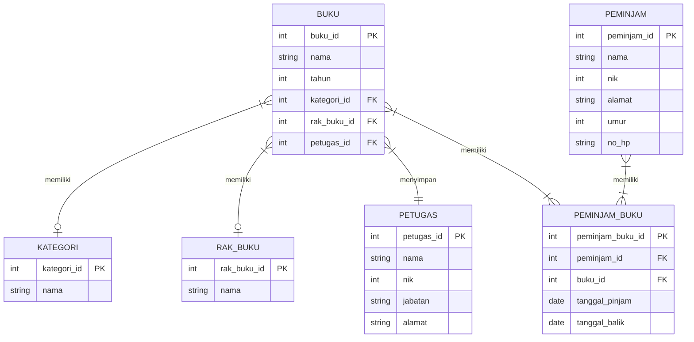

# ERD Sistem Perpustakaan

```mermaid
erDiagram
  BUKU {
    int buku_id PK
    string nama
    int tahun
    int kategori_id FK
    int rak_buku_id FK
    int petugas_id FK
  }
  KATEGORI {
    int kategori_id PK
    string nama
  }
  RAK_BUKU {
    int rak_buku_id PK
    string nama
  }
  PETUGAS {
    int petugas_id PK
    string nama
    int nik
    string jabatan
    string alamat
  }
  PEMINJAM {
    int peminjam_id PK
    string nama
    int nik
    string alamat
    int umur
    string no_hp
  }
  PEMINJAM_BUKU {
    int peminjam_buku_id PK
    int peminjam_id FK
    int buku_id FK
    date tanggal_pinjam
    date tanggal_balik
  }

  BUKU }| -- o| KATEGORI : memiliki
  BUKU }| -- o| RAK_BUKU : memiliki
  BUKU }| -- || PETUGAS : menyimpan
  BUKU }| -- |{ PEMINJAM_BUKU : memiliki
  PEMINJAM }| -- |{ PEMINJAM_BUKU : memiliki
```